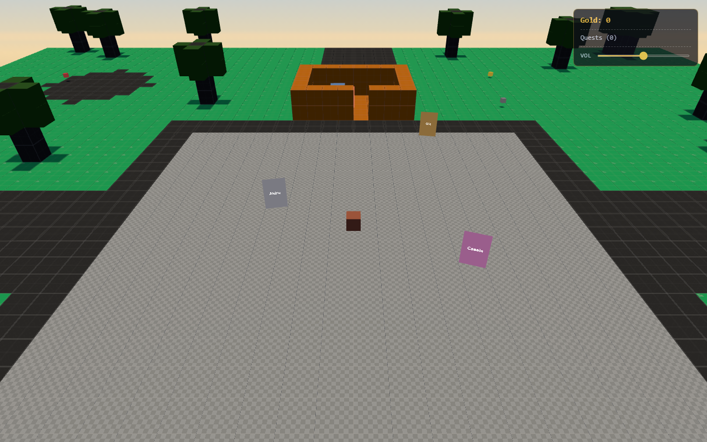
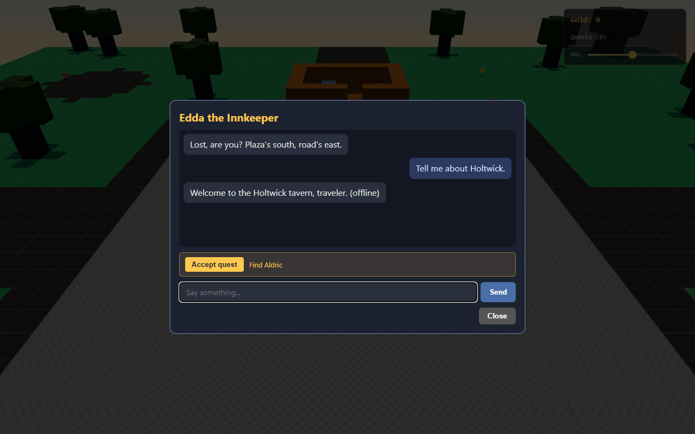
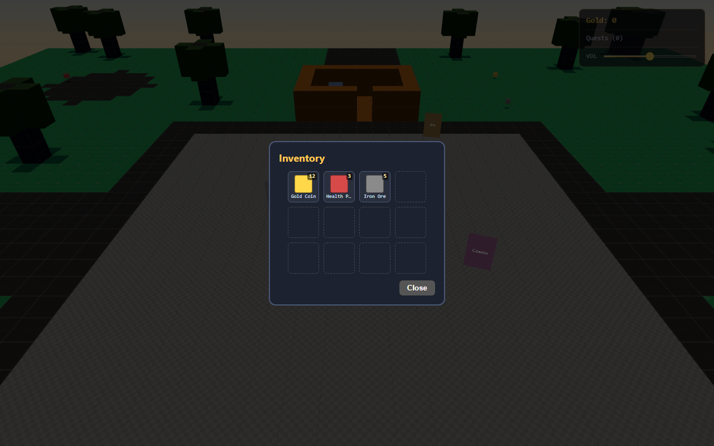
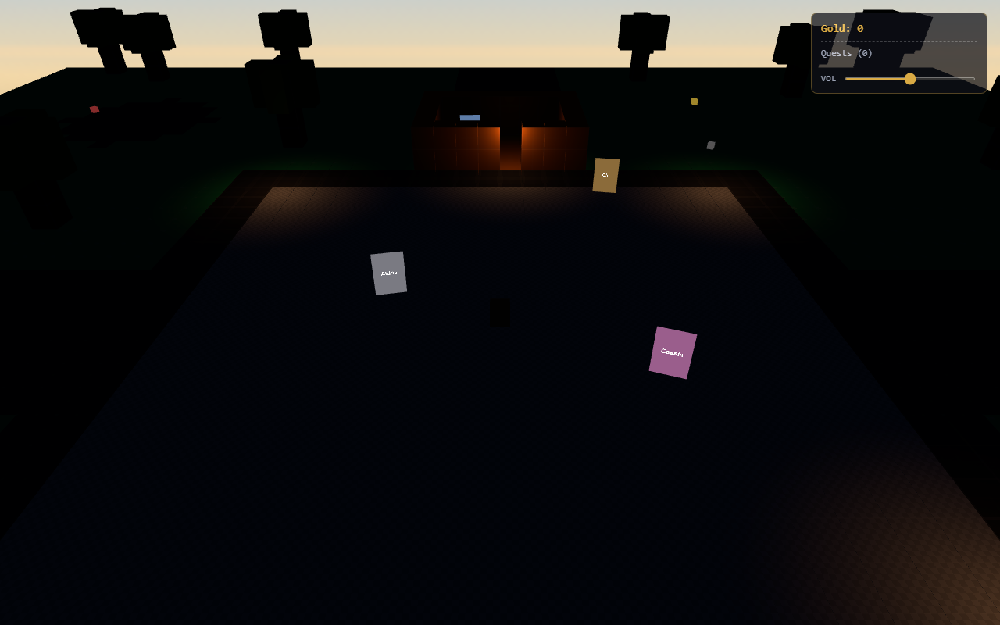

# Holtwick Voxel

3D voxel rogue-like set in the Holtwick Tavern world. Three.js renderer, cloud-LLM NPCs (Cloudflare Worker -> Groq Llama-3.1-8B), procedural voxel village with day/night, quests, inventory, save/load, and a tavern at the center.

**Play it →** https://lucianosmori.github.io/holtwick-voxel/

Companion to [holtwick-tavern](https://github.com/lucianosmori/holtwick-tavern) (2D web chat with the same 31 NPCs).

## Status

Playable. Procedural village with 4 building types, 12 friendly NPCs (3 of them on walking patrols), 4 quests, 3 item types, day/night with synchronized lanterns, procedural Web Audio ambient + footsteps, persistent save/load, minimap + settings + FPS overlays, and a Playwright visual-validation gate that exercises the whole flow end-to-end. PixelLab pixel-art NPC sprites land when API credits are topped up.

| Slice | State |
|---|---|
| Voxel renderer + Kenney CC0 textures | ✅ |
| Procedural village floor (grass/dirt/stone/water) | ✅ |
| Buildings — tavern, blacksmith forge, well, 2 market stalls | ✅ |
| Player movement + camera follow + collision (per-y range) | ✅ |
| Lighting + shadows + procedural cube-sky | ✅ |
| Day/night cycle (sun orbit + hemisphere blend, adjustable length) | ✅ |
| NPC dialog modal (Cloudflare/Groq with scripted-bark fallback) | ✅ |
| 12 NPCs (`tavernCast.ts`) — innkeeper, bard, watch, herbalist, smith, apprentice, stablehand, merchant, well-keeper, baker, messenger, miner | ✅ |
| Walking NPCs (Edda, Finn, Cassia waypoint patrols, halt near player) | ✅ |
| NPC idle barks (proximity-triggered floating text) | ✅ |
| Quests — 4 (talk-to ×2, collect ×2; gold + item rewards) | ✅ |
| Quest log HUD + gold counter | ✅ |
| Item schema + 3 items + world spawn + pickup + toast | ✅ |
| Inventory modal (`I` key, 4×3 grid, focus-gated) | ✅ |
| Save/load to localStorage (player + quests + inventory + picked items + phase) | ✅ |
| Procedural ambient audio + footsteps + volume slider | ✅ |
| Trees + foliage (30 procedurally placed) | ✅ |
| Lantern night lighting (4 warm PointLights ramped by phase) | ✅ |
| Minimap HUD (top-left 150×150 with player/NPC/item/lantern dots) | ✅ |
| Settings modal (gear icon — volume, day length, reset save) | ✅ |
| FPS overlay (backtick toggle) | ✅ |
| Title screen splash | ✅ |
| Mobile joystick + interact button + proximity banner | ✅ |
| Playwright visual + dialog validation gate (CI on every push) | ✅ |
| NPC pixel-art sprites (31, via PixelLab) | ⏳ blocked on credits |
| Per-NPC TTS | ⏳ deferred to v2 |

Iteration history in [`NOTES.md`](./NOTES.md); active task list in [`IMPLEMENTATION_PLAN.md`](./IMPLEMENTATION_PLAN.md).

## Controls

| Input | Action |
|---|---|
| `W` `A` `S` `D` / Arrow keys | Move on the XZ plane (axis-separated AABB collision; slides along walls) |
| Touch joystick (mobile) | Same as WASD; appears bottom-left on coarse-pointer devices |
| `E` / on-screen **Interact** button | Open dialog with the nearest NPC inside the 3-voxel proximity ring |
| `I` | Toggle inventory modal (4×3 grid). Gated when the chat input is focused so typing `i` doesn't open it |
| `` ` `` (Backquote) | Toggle FPS / draw-call / frame-time overlay (bottom-right) |
| Gear icon (top-right) | Open settings — master volume, day length (60–1800 s), reset save |
| Volume slider (HUD) | Master gain for ambient + footsteps; persists across reloads |
| `Esc` | Close any open modal (dialog, inventory, settings, title) |
| Click | Title splash dismiss / settings backdrop close |

## Gameplay

- **Move** with WASD or arrow keys. On touch devices a virtual joystick appears bottom-left.
- **Talk to NPCs** by walking within 3 voxels and pressing `E` (or the on-screen Interact button on mobile). A proximity banner hints when an NPC is close; idle barks float above NPCs you stand next to. Type a message and `Enter` to chat — replies stream from the Cloudflare/Groq proxy; if the proxy is unreachable the NPC falls back to scripted barks.
- **Quests.** Four are live:
  - *Find Aldric* — Edda asks you to talk to the watchman (+10 gold).
  - *Iron for the Forge* — Finn fetches for Boran; collect 3 iron ore (+25 gold).
  - *Visit the Well* — Hilda hands out a self-completing talk-to on second visit (+5 gold).
  - *Coins for a Song* — Finn's second quest; drop 5 gold coins into his cap and he trades you 1 health potion (item-reward path).
- **Inventory.** World items hover-spin on the ground (gold coins, health potions, iron ore). Walk over one to pick it up; a toast confirms. Press `I` to open the 4×3 inventory grid; picked items don't respawn after reload.
- **Save/load.** State auto-saves to `localStorage` (debounced 500 ms + 30 s heartbeat). Reload the page and player position, day/night phase, quests, inventory, gold, and which world items have already been picked all restore. Reset save lives in the settings modal.
- **Day/night.** Default cycle is ~2 minutes (adjustable 60–1800 s in settings). Sun orbits in XZ, hemisphere colors blend dawn→day→dusk→night. Four lanterns (tavern doorway + 3 plaza corners) ignite at dusk and peak at midnight.
- **Audio.** Procedural ambient (pink-noise wind + occasional bird chirps in day, throbbing cricket at night) with a volume slider in the HUD. Footsteps fire on player travel; all routed through a single master gain that persists.
- **Buildings.** Plank tavern at plaza-north (interior 6×4, doorway south), blacksmith forge with stone anvil east of the plaza, stone-ringed well with a water-cell centre south-east, and two plank market stalls (4 corner posts + canopy) on the plaza-south edge.
- **HUDs.** Top-right: gold + quest log (rows tint amber for active, green for done). Top-left: 150×150 minimap with roads, plaza, tavern outline, and live dots for NPCs, items, lit lanterns, and the player.

## Roster

12 friendly NPCs live in the village. Each has a persona JSON (role + idle/combat barks) feeding the LLM system prompt. Spawn cells are in `src/data/npcSpawns.ts`.

| ID | Name | Role |
|---|---|---|
| `edda` | Edda the Innkeeper | Innkeeper of the Holtwick tavern (gives *Find Aldric*) |
| `finn` | Finn the Bard | Wandering lute-player who winters at the tavern (gives *Iron for the Forge* + *Coins for a Song*) |
| `aldric` | Aldric of the Village Watch | Veteran town guard standing post on the plaza |
| `mireille` | Mireille the Herbalist | Tends a garden by the pond |
| `boran` | Old Boran the Blacksmith | Works the forge outside the tavern |
| `wren` | Wren the Stablehand | Young hand at the east-edge stables |
| `cassia` | Cassia the Merchant | Travelling merchant with cloth + trinkets on the plaza |
| `karsten` | Karsten the Apprentice Smith | Boran's apprentice on the bellows |
| `hilda` | Hilda the Well-Keeper | Wisewoman who reads the village well (gives *Visit the Well*) |
| `petra` | Petra the Baker | Sells loaves from a market stall under canopy |
| `ronan` | Ronan the Messenger | Courier between Holtwick and the eastern towns |
| `dorin` | Dorin the Miner | Weather-worn miner who wanders the plaza between shifts |

## Recap by the numbers

- **4 quests** (2 talk-to, 2 collect; gold + item reward paths covered)
- **3 item types** (gold_coin, health_potion, iron_ore — emissive hover-cubes; 12 spawn per village seed)
- **4 building types** (tavern + blacksmith forge + well + 2 market stalls)
- **12 NPCs** (3 on walking waypoints, all chat-enabled, proximity barks on the rest)
- **30 trees** (procedurally placed, instanced trunk+canopy)
- **4 lanterns** (PointLights ramped by day/night phase)
- **2-minute** default day/night cycle (60–1800 s in settings)
- **64 × 3 × 64** voxel grid (`Uint8Array`, deterministic seeded generation)

## Screenshots

| | |
|---|---|
|  |  |
| Procedural village at noon — grass plaza, dirt roads, plank tavern, pond. | NPC dialog modal streaming a reply from the Cloudflare/Groq proxy. |
|  |  |
| 4×3 inventory grid populated with gold, potions, and iron ore. | Same village at midnight — lanterns lit, cool moonlit hemisphere. |

Regenerate the gallery with `node scripts/capture-showcase.mjs` after a `npm run build`.

## Develop locally

```bash
npm install
npm run dev          # vite dev server on :5173
npm run build        # tsc --noEmit + vite build
npm run preview      # serve dist/ on :4173 (matches the live build)
npm run validate:visual  # headless Playwright screenshot + console-error check
npm run test:dialog      # headless Playwright dialog/quest/inventory flow assertions
```

The `validate:visual` and `test:dialog` gates also run in CI on every push (`.github/workflows/visual-validation.yml`) — keeps Playwright off the dev machine while still gating regressions.

## Stack

- **Renderer:** Three.js r160, `InstancedMesh` per voxel type, `MeshStandardMaterial` with Kenney prototype textures (`NearestFilter` for crisp pixel look)
- **World:** 64×3×64 voxel grid (`Uint8Array`), procedural village generator (deterministic seed), procedural cube-sky background, 30 instanced trees, 4 buildings (tavern + blacksmith + well + 2 stalls), 4 warm PointLights
- **Lighting:** `HemisphereLight` + `DirectionalLight` orbiting on a 2-minute (settings-adjustable) day/night cycle, PCF soft shadows, lanterns ramped by phase
- **NPCs:** `PlaneGeometry` billboards facing the camera (Y-axis only); 12 personas in `src/data/tavernCast.ts` (innkeeper, bard, watch, herbalist, smith, apprentice, stablehand, merchant, well-keeper, baker, messenger, miner). 3 walk waypoints with proximity-halt; rest emit idle barks when the player is close.
- **Chat:** Cloudflare Worker ([holtwick-llm-proxy](https://github.com/lucianosmori/holtwick-llm-proxy)) -> Groq `llama-3.1-8b-instant`. Cross-browser, no client-side model download, $0/month on free tiers. Per-NPC history capped at 12 turns, scripted-bark offline fallback.
- **Audio:** Web Audio API — pink-noise day chain (lowpass + rumble + chirps), AM-modulated cricket night chain, crossfade on phase boundaries, footsteps via 50 ms white-noise bursts. Master gain persists to `localStorage`. No asset downloads.
- **Persistence:** `localStorage` SaveV1 — player XZ + dayNight phase + quests + inventory + gold + picked-item indices. Debounced 500 ms + 30 s heartbeat + on-dialog-close.
- **HUD:** quest log + gold counter (top-right), minimap with player/NPC/item/lantern dots (top-left), volume slider, settings gear (top-right), FPS overlay (bottom-right, toggleable).
- **Validation:** Playwright headless Chromium gate (CI on every push) — screenshot to `artifacts/screenshots/iter-NN.png`, pixel-content assert (catches blank-canvas regressions), console-error guard, full dialog/quest/pickup/inventory/save-load/walker/audio/lantern/minimap/settings/FPS flow exercised end-to-end.

## License

MIT. Voxel textures from [Kenney Prototype Textures](https://kenney.nl/assets/prototype-textures) (CC0).
